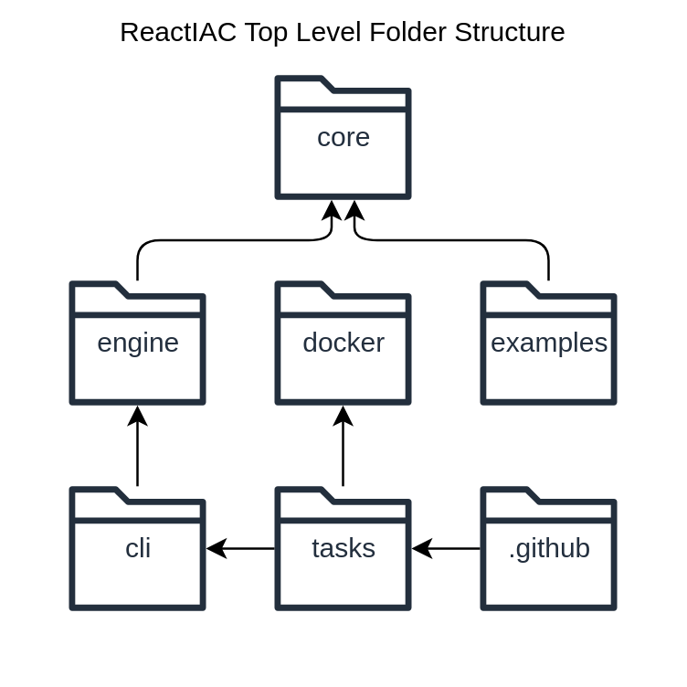
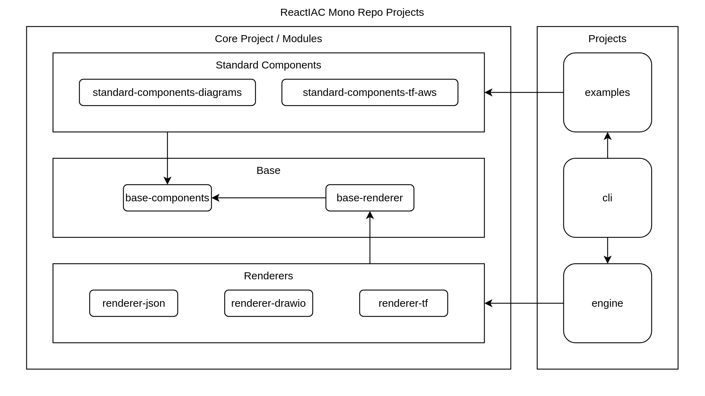

= Dinghy
:toc:

image:https://github.com/dinghy/dinghy/actions/workflows/release.yml/badge.svg[release,link=https://github.com/dinghy/dinghy/actions/workflows/release.yml] image:https://github.com/dinghy/dinghy/actions/workflows/verification.yml/badge.svg[verification,link=https://github.com/dinghy/dinghy/actions/workflows/verification.yml]

== Development

This project is developed with deno and VSCode.

=== Install deno

    curl -fsSL https://deno.land/install.sh | sh

=== Tasks

Set of debugable tasks defined in https://github.com/dinghy/dinghy/blob/main/.vscode/launch.json[.vscode/launch.json]

== Architecture

=== Folder Structure

Relationship of top level folders:

=== Mono Repo

This is a mono repo with multiple relatively independent projects:

