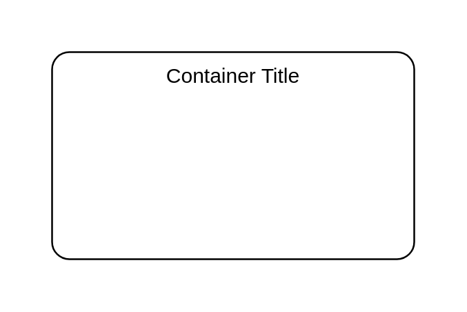

# Choreography Task

## Definition

```
{
  _style: {
    group: 'rounded=1;whiteSpace=wrap;html=1;container=1;collapsible=0;absoluteArcSize=1;arcSize=20;childLayout=stackLayout;horizontal=1;horizontalStack=0;resizeParent=1;resizeParentMax=0;resizeLast=0;',
    
  },
}
```

## Usage

```
import { ChoreographyTask } from '@dinghy/standard-components-diagrams/bpmn2Choreographies'

<ChoreographyTask/>
```

## Preview


