# BPMN 2.0 Tasks Containers

- [AdHocCollapsed](./ad-hoc-collapsed.md)  
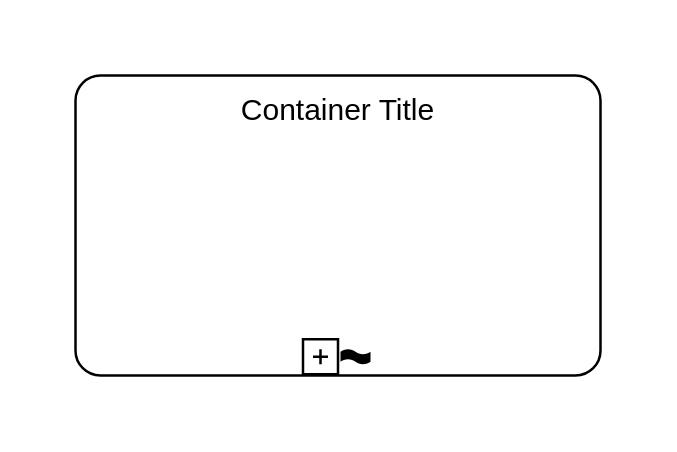

- [AdHocExpanded](./ad-hoc-expanded.md)  
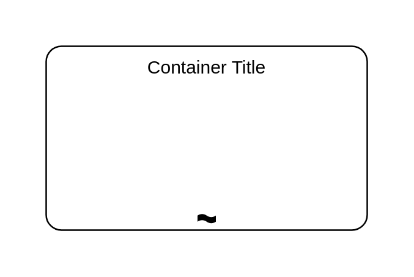

- [BusinessRule](./business-rule.md)  

- [BusinessRuleCallActivity](./business-rule-call-activity.md)  
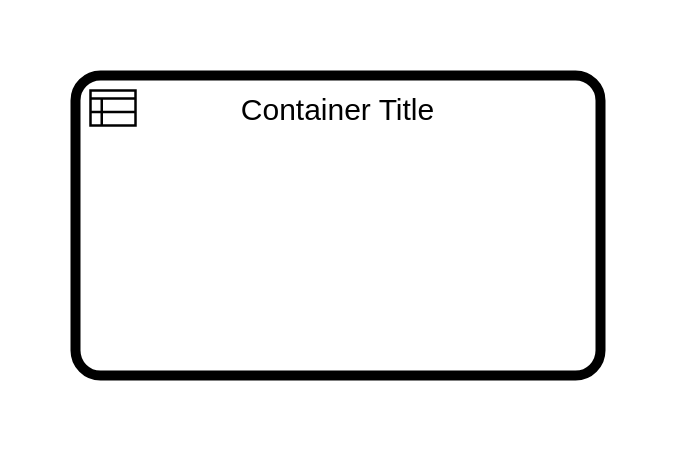

- [CallActivity](./call-activity.md)  
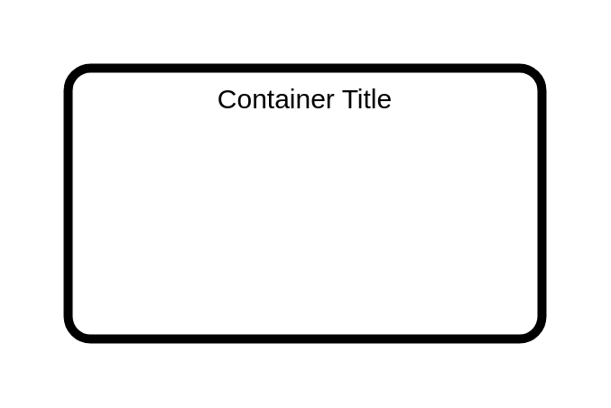

- [CallActivityCollapsed](./call-activity-collapsed.md)  
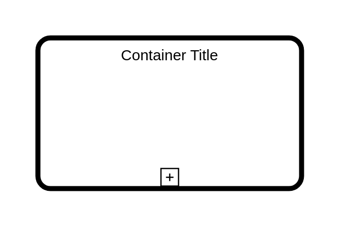

- [CallActivityExpanded](./call-activity-expanded.md)  
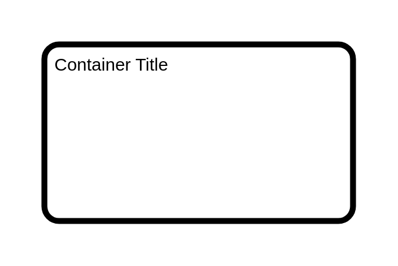

- [Compensation](./compensation.md)  
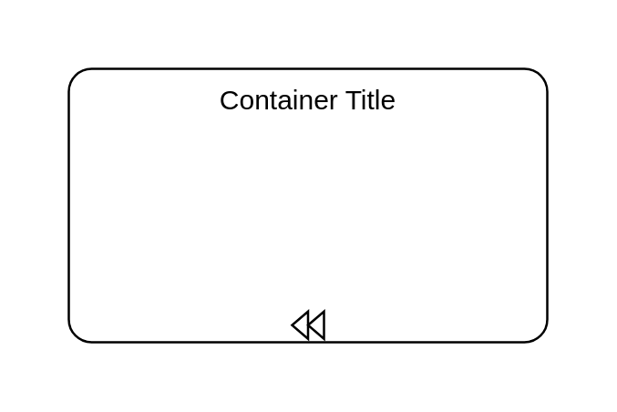

- [Compensation2](./compensation-2.md)  

- [CompensationEventSubProcessInterruptingCollapsed](./compensation-event-sub-process-interrupting-collapsed.md)  

- [ConditionalEventSubProcessInterruptingCollapsed](./conditional-event-sub-process-interrupting-collapsed.md)  

- [ConditionalEventSubProcessNonInterruptingCollapsed](./conditional-event-sub-process-non-interrupting-collapsed.md)  

- [ErrorEventSubProcessInterruptingCollapsed](./error-event-sub-process-interrupting-collapsed.md)  

- [EscalationEventSubProcessInterruptingCollapsed](./escalation-event-sub-process-interrupting-collapsed.md)  

- [EscalationEventSubProcessNonInterruptingCollapsed](./escalation-event-sub-process-non-interrupting-collapsed.md)  

- [GenericTask](./generic-task.md)  
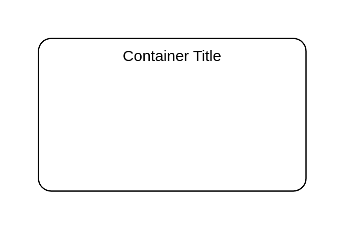

- [LoopAndCompensation](./loop-and-compensation.md)  
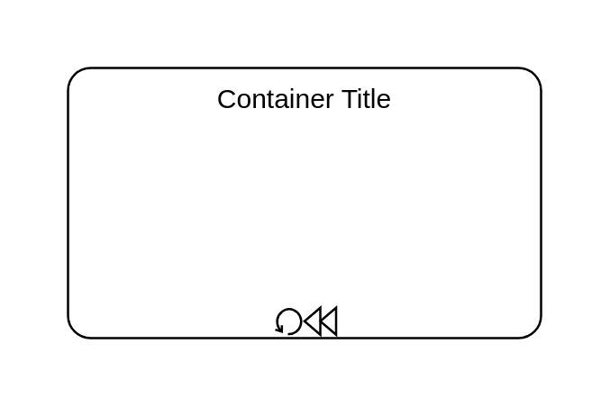

- [LoopAndCompensation2](./loop-and-compensation-2.md)  
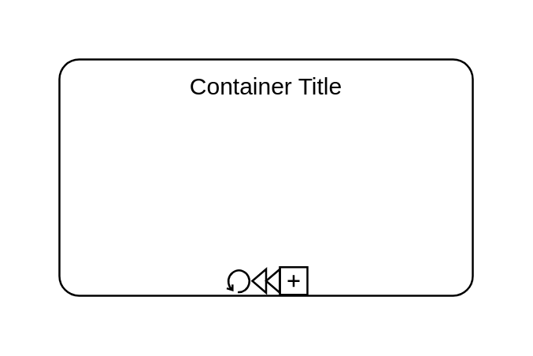

- [Manual](./manual.md)  
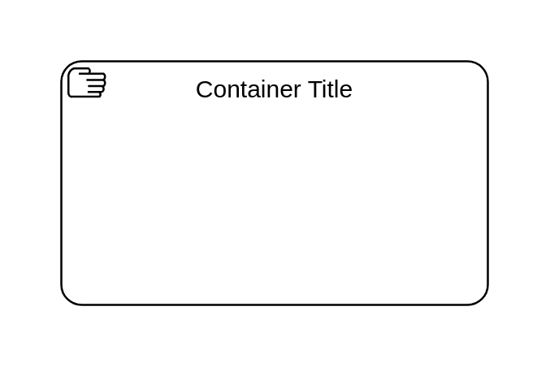

- [ManualCallActivity](./manual-call-activity.md)  

- [MessageEventSubProcessInterruptingCollapsed](./message-event-sub-process-interrupting-collapsed.md)  

- [MessageEventSubProcessNonInterruptingCollapsed](./message-event-sub-process-non-interrupting-collapsed.md)  

- [MultiInstanceParallel](./multi-instance-parallel.md)  
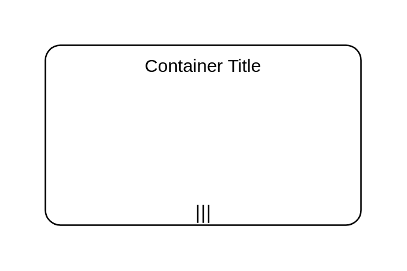

- [MultiInstanceParallel2](./multi-instance-parallel-2.md)  

- [MultiInstanceSequential](./multi-instance-sequential.md)  

- [MultiInstanceSequential2](./multi-instance-sequential-2.md)  
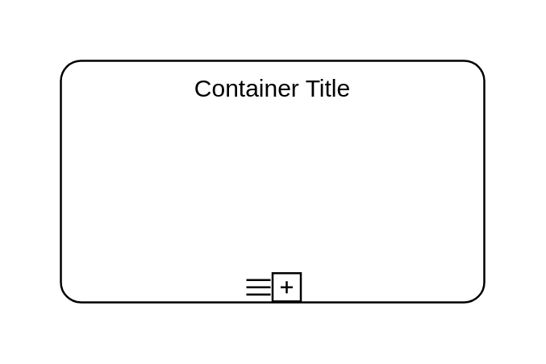

- [MultipleEventSubProcessInterruptingCollapsed](./multiple-event-sub-process-interrupting-collapsed.md)  

- [MultipleEventSubProcessNonInterruptingCollapsed](./multiple-event-sub-process-non-interrupting-collapsed.md)  

- [ParallelMultipleEventSubProcessInterruptingCollapsed](./parallel-multiple-event-sub-process-interrupting-collapsed.md)  

- [ParallelMultipleEventSubProcessNonInterruptingCollapsed](./parallel-multiple-event-sub-process-non-interrupting-collapsed.md)  

- [Receive](./receive.md)  

- [Script](./script.md)  

- [ScriptCallActivity](./script-call-activity.md)  

- [Send](./send.md)  
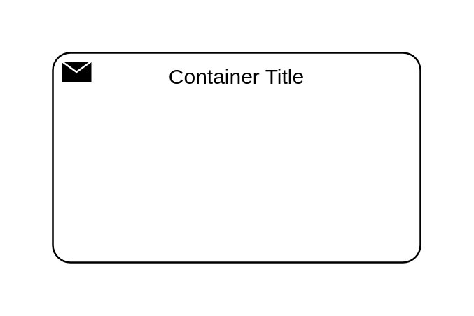

- [Service](./service.md)  

- [SignalEventSubProcessInterruptingCollapsed](./signal-event-sub-process-interrupting-collapsed.md)  

- [SignalEventSubProcessNonInterruptingCollapsed](./signal-event-sub-process-non-interrupting-collapsed.md)  
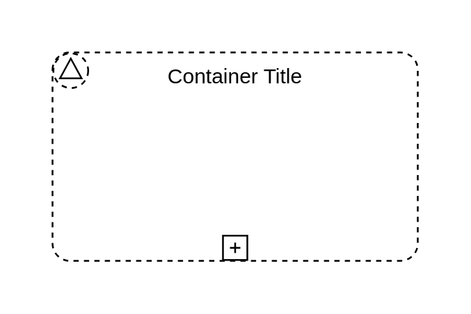

- [StandardLoop](./standard-loop.md)  

- [StandardLoop2](./standard-loop-2.md)  

- [SubProcessCollapsed](./sub-process-collapsed.md)  
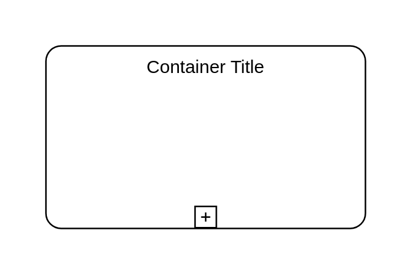

- [TimerEventSubProcessInterruptingCollapsed](./timer-event-sub-process-interrupting-collapsed.md)  

- [TimerEventSubProcessNonInterruptingCollapsed](./timer-event-sub-process-non-interrupting-collapsed.md)  

- [TransactionCollapsed](./transaction-collapsed.md)  
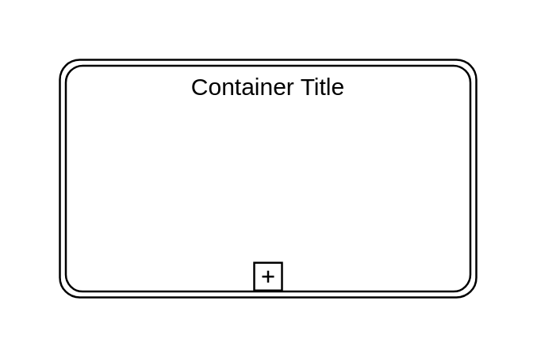

- [TransactionExpanded](./transaction-expanded.md)  

- [User](./user.md)  
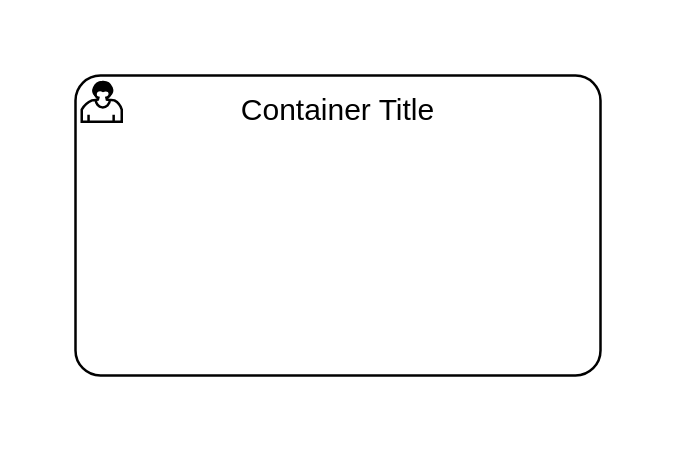

- [UserCallActivity](./user-call-activity.md)  
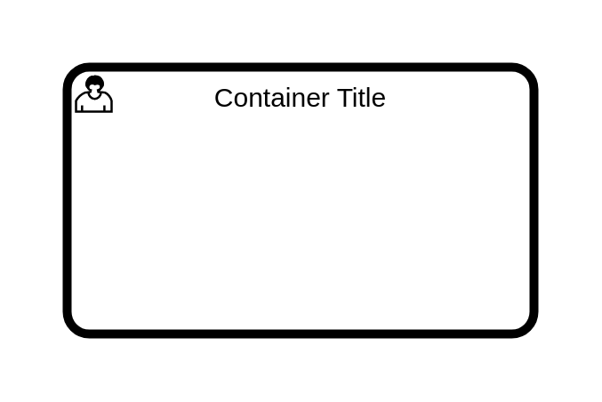
