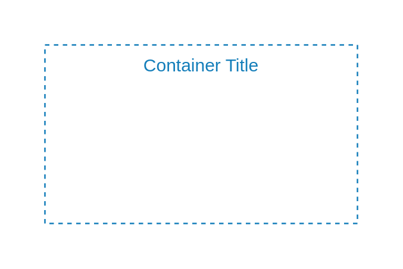

# Availability Zone

## Definition

```
{
  _style: {
    group: 'fillColor=none;strokeColor=#147EBA;dashed=1;verticalAlign=top;fontStyle=0;fontColor=#147EBA;whiteSpace=wrap;html=1;',
    entity:{
      strokeColor:'#147EBA',fontColor:'#147EBA',},
    
  },
}
```

## Usage

```
import { AvailabilityZone } from '@dinghy/standard-components-diagrams/awsGroups'

<AvailabilityZone/>
```

## Preview


