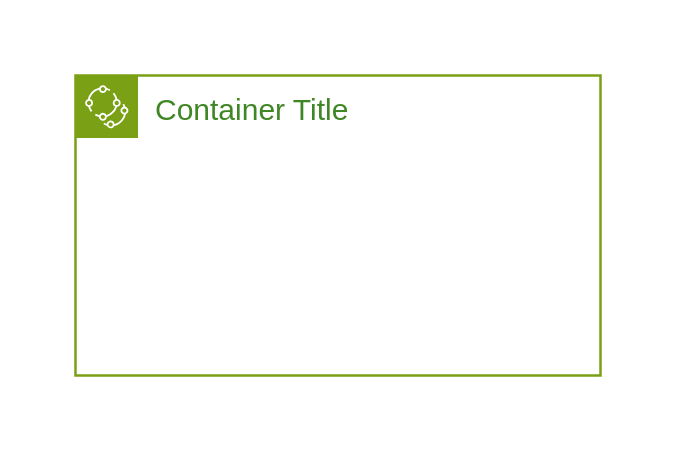

# AWS Iot Greengrass Deployment

## Definition

```
{
  _style: {
    group: 'points=[[0,0],[0.25,0],[0.5,0],[0.75,0],[1,0],[1,0.25],[1,0.5],[1,0.75],[1,1],[0.75,1],[0.5,1],[0.25,1],[0,1],[0,0.75],[0,0.5],[0,0.25]];outlineConnect=0;gradientColor=none;html=1;whiteSpace=wrap;fontSize=12;fontStyle=0;container=1;pointerEvents=0;collapsible=0;recursiveResize=0;shape=mxgraph.aws4.group;grIcon=mxgraph.aws4.group_iot_greengrass_deployment;strokeColor=#7AA116;fillColor=none;verticalAlign=top;align=left;spacingLeft=30;fontColor=#3F8624;dashed=0;',
    entity:{
      strokeColor:'#7AA116',fontColor:'#3F8624',},
    
  },
}
```

## Usage

```
import { AwsIotGreengrassDeployment } from '@reactiac/standard-components-diagrams/awsGroups'

<AwsIotGreengrassDeployment/>
```

## Preview


