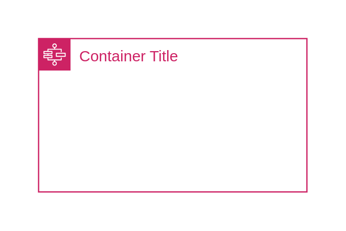

# AWS Step Functions workflow

## Definition

```
{
  _style: {
    group: 'points=[[0,0],[0.25,0],[0.5,0],[0.75,0],[1,0],[1,0.25],[1,0.5],[1,0.75],[1,1],[0.75,1],[0.5,1],[0.25,1],[0,1],[0,0.75],[0,0.5],[0,0.25]];outlineConnect=0;gradientColor=none;html=1;whiteSpace=wrap;fontSize=12;fontStyle=0;container=1;pointerEvents=0;collapsible=0;recursiveResize=0;shape=mxgraph.aws4.group;grIcon=mxgraph.aws4.group_aws_step_functions_workflow;strokeColor=#CD2264;fillColor=none;verticalAlign=top;align=left;spacingLeft=30;fontColor=#CD2264;dashed=0;',
    entity:{
      strokeColor:'#CD2264',fontColor:'#CD2264',},
    
  },
}
```

## Usage

```
import { AwsStepFunctionsWorkflow } from '@dinghy/standard-components-diagrams/awsGroups'

<AwsStepFunctionsWorkflow/>
```

## Preview


