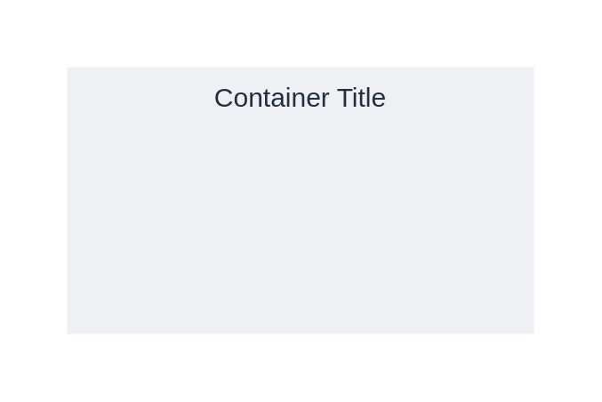

# Generic group 2

## Definition

```
{
  _style: {
    group: 'fillColor=#EFF0F3;strokeColor=none;dashed=0;verticalAlign=top;fontStyle=0;fontColor=#232F3D;whiteSpace=wrap;html=1;',
    entity:{
      fillColor:'#EFF0F3',fontColor:'#232F3D',},
    
  },
}
```

## Usage

```
import { GenericGroup2 } from '@reactiac/standard-components-diagrams/awsGroups'

<GenericGroup2/>
```

## Preview


