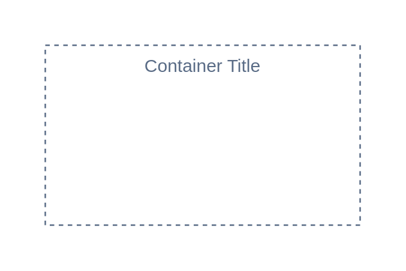

# Generic group

## Definition

```
{
  _style: {
    group: 'fillColor=none;strokeColor=#5A6C86;dashed=1;verticalAlign=top;fontStyle=0;fontColor=#5A6C86;whiteSpace=wrap;html=1;',
    entity:{
      strokeColor:'#5A6C86',fontColor:'#5A6C86',},
    
  },
}
```

## Usage

```
import { GenericGroup } from '@reactiac/standard-components-diagrams/awsGroups'

<GenericGroup/>
```

## Preview


