# Aws Groups Containers

- [AutoScalingGroup](./auto-scaling-group.md)  
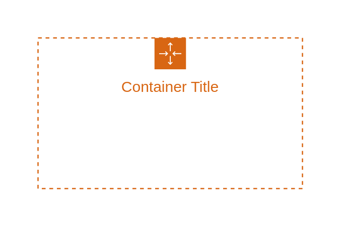

- [AvailabilityZone](./availability-zone.md)  

- [AwsAccount](./aws-account.md)  
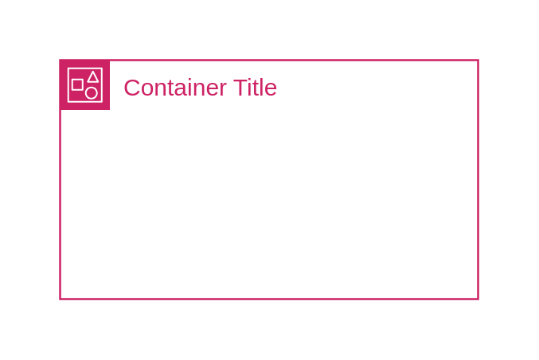

- [AwsCloud](./aws-cloud.md)  
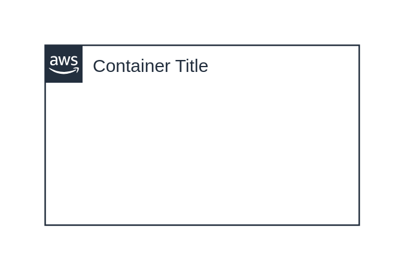

- [AwsCloud2](./aws-cloud-2.md)  
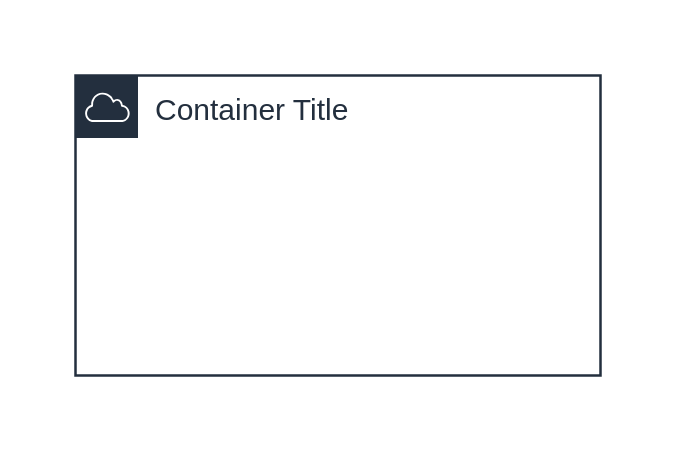

- [AwsIotGreengrass](./aws-iot-greengrass.md)  
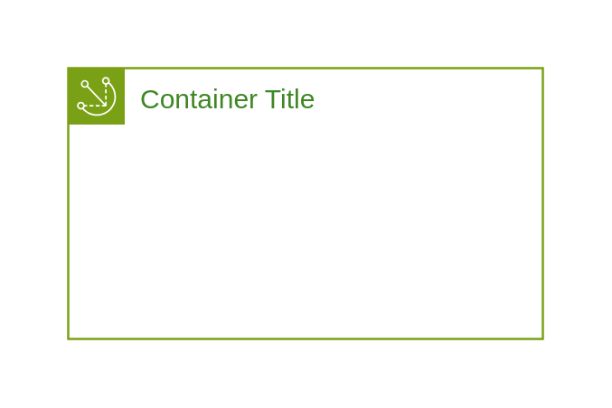

- [AwsIotGreengrassDeployment](./aws-iot-greengrass-deployment.md)  

- [AwsStepFunctionsWorkflow](./aws-step-functions-workflow.md)  

- [CorporateDataCenter](./corporate-data-center.md)  
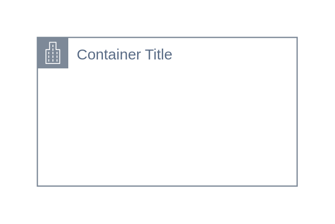

- [Ec2InstanceContents](./ec2-instance-contents.md)  

- [ElasticBeanstalkContainer](./elastic-beanstalk-container.md)  

- [GenericGroup](./generic-group.md)  

- [GenericGroup2](./generic-group-2.md)  

- [PrivateSubnet](./private-subnet.md)  
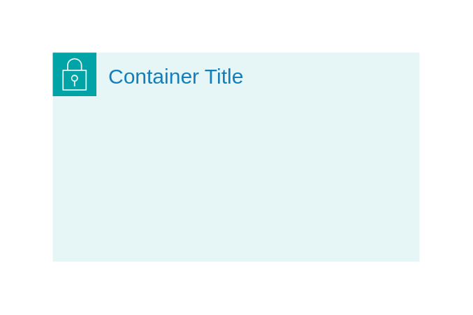

- [PublicSubnet](./public-subnet.md)  
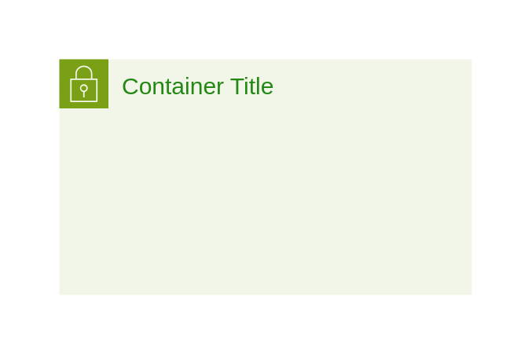

- [Region](./region.md)  
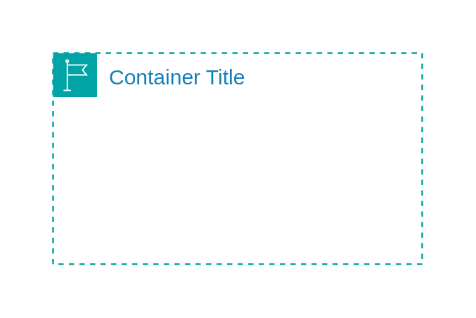

- [SecurityGroup](./security-group.md)  
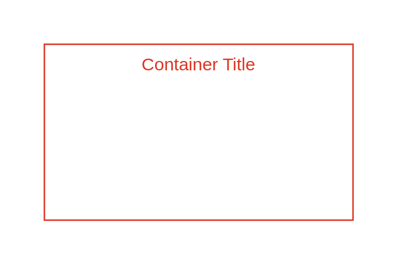

- [ServerContents](./server-contents.md)  

- [SpotFleet](./spot-fleet.md)  
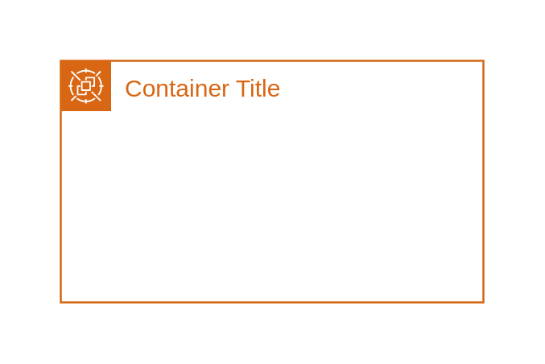

- [Vpc](./vpc.md)  
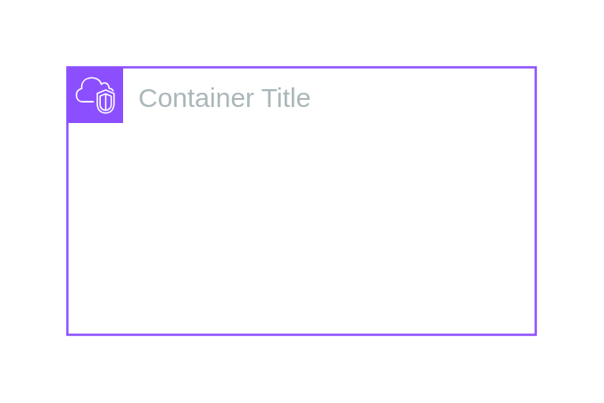
