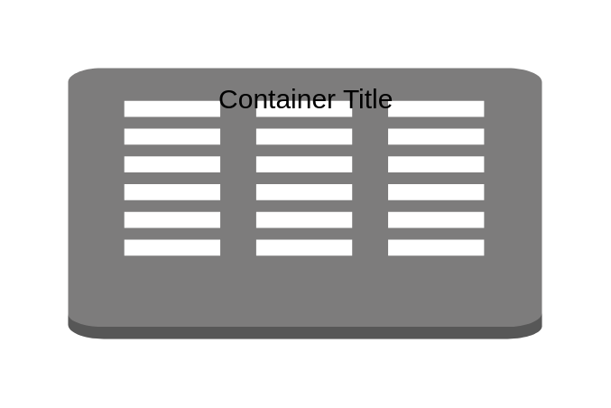

# Corporate Data Center

## Definition

```
{
  _style: {
    group: 'dashed=0;html=1;shape=mxgraph.aws3.corporate_data_center;fillColor=#7D7C7C;gradientColor=none;dashed=0;',
    entity:{
      fillColor:'#7D7C7C',},
    
  },
}
```

## Usage

```
import { CorporateDataCenter } from '@dinghy/standard-components-diagrams/aws17Groups'

<CorporateDataCenter/>
```

## Preview


