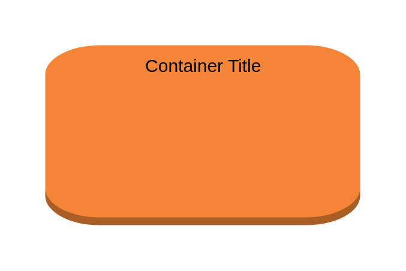

# EC2 Instance Container

## Definition

```
{
  _style: {
    group: 'dashed=0;html=1;shape=mxgraph.aws3.instance;fillColor=#F58536;gradientColor=none;dashed=0;',
    entity:{
      fillColor:'#F58536',},
    
  },
}
```

## Usage

```
import { Ec2InstanceContainer } from '@dinghy/standard-components-diagrams/aws17Groups'

<Ec2InstanceContainer/>
```

## Preview


