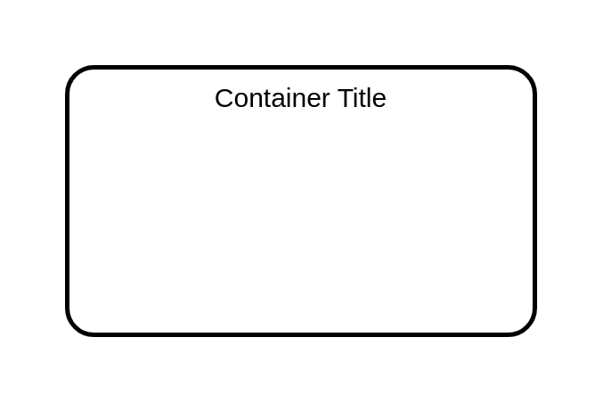

# Elastic Beanstalk Container

## Definition

```
{
  _style: {
    group: 'rounded=1;arcSize=10;dashed=0;fillColor=none;gradientColor=none;strokeWidth=2;',
    
  },
}
```

## Usage

```
import { ElasticBeanstalkContainer } from '@dinghy/standard-components-diagrams/aws17Groups'

<ElasticBeanstalkContainer/>
```

## Preview


