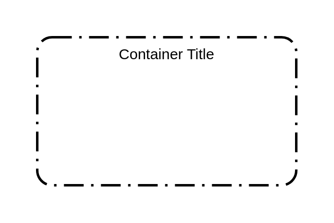
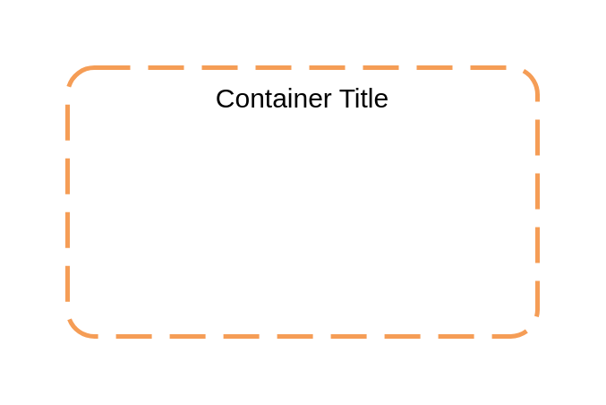
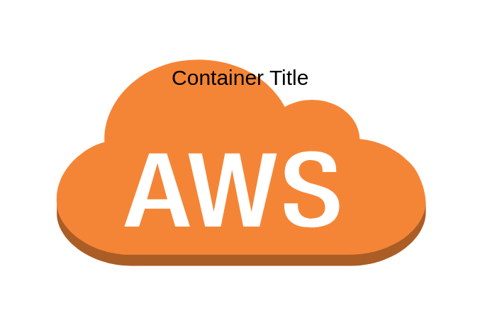
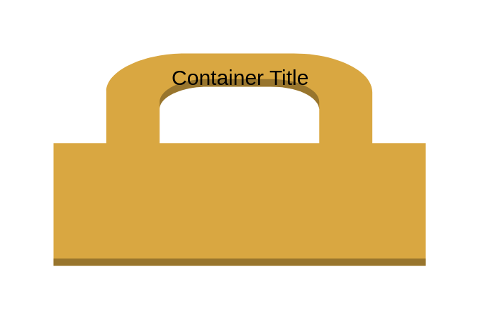

# Aws17 Groups Containers

- [AutoScalingGroup](./auto-scaling-group.md)  

- [AvailabilityZone](./availability-zone.md)  

- [AwsCloud](./aws-cloud.md)  

- [CorporateDataCenter](./corporate-data-center.md)  

- [Ec2InstanceContainer](./ec2-instance-container.md)  

- [ElasticBeanstalkContainer](./elastic-beanstalk-container.md)  

- [ElasticBeanstalkContainer2](./elastic-beanstalk-container-2.md)  

- [Region](./region.md)  

- [SecurityGroup](./security-group.md)  

- [ServerContents](./server-contents.md)  

- [VirtualPrivateCloud](./virtual-private-cloud.md)  

- [VpcSubnet](./vpc-subnet.md)  

