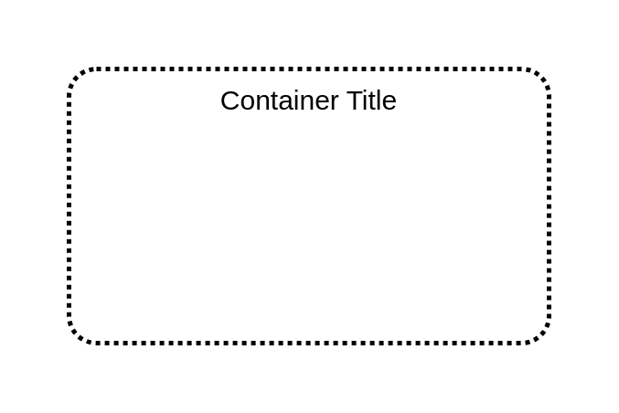

# Region

## Definition

```
{
  _style: {
    group: 'rounded=1;arcSize=10;dashed=1;fillColor=none;gradientColor=none;dashPattern=1 1;strokeWidth=2;',
    
  },
}
```

## Usage

```
import { Region } from '@reactiac/standard-components-diagrams/aws17Groups'

<Region/>
```

## Preview


