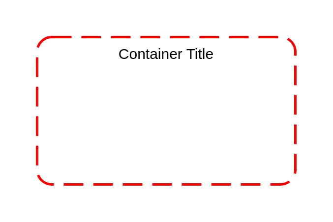

# Security Group

## Definition

```
{
  _style: {
    group: 'rounded=1;arcSize=10;dashed=1;strokeColor=#ff0000;fillColor=none;gradientColor=none;dashPattern=8 4;strokeWidth=2;',
    entity:{
      strokeColor:'#ff0000',},
    
  },
}
```

## Usage

```
import { SecurityGroup } from '@reactiac/standard-components-diagrams/aws17Groups'

<SecurityGroup/>
```

## Preview


