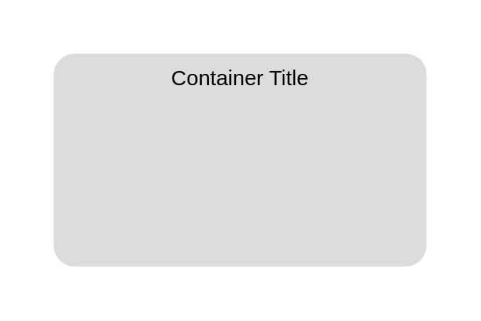

# Server Contents

## Definition

```
{
  _style: {
    group: 'rounded=1;arcSize=10;strokeColor=none;fillColor=#DBDBDB;gradientColor=none;',
    entity:{
      fillColor:'#DBDBDB',},
    
  },
}
```

## Usage

```
import { ServerContents } from '@diac/standard-components-diagrams/aws17Groups'

<ServerContents/>
```

## Preview


