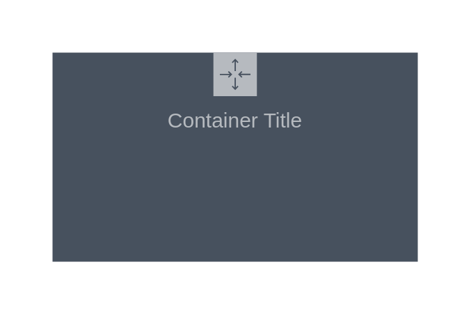

# Auto Scaling Group

## Definition

```
{
  _style: {
    group: 'sketch=0;outlineConnect=0;gradientColor=none;html=1;whiteSpace=wrap;fontSize=12;fontStyle=0;shape=mxgraph.aws4.groupCenter;grIcon=mxgraph.aws4.group_auto_scaling_group;grStroke=0;strokeColor=#B6BABF;fillColor=#47515E;verticalAlign=top;align=center;fontColor=#B6BABF;dashed=0;spacingTop=25;',
    entity:{
      strokeColor:'#B6BABF',fillColor:'#47515E',fontColor:'#B6BABF',},
    
  },
}
```

## Usage

```
import { AutoScalingGroup } from '@dinghy/standard-components-diagrams/aws18GroupsDark'

<AutoScalingGroup/>
```

## Preview


