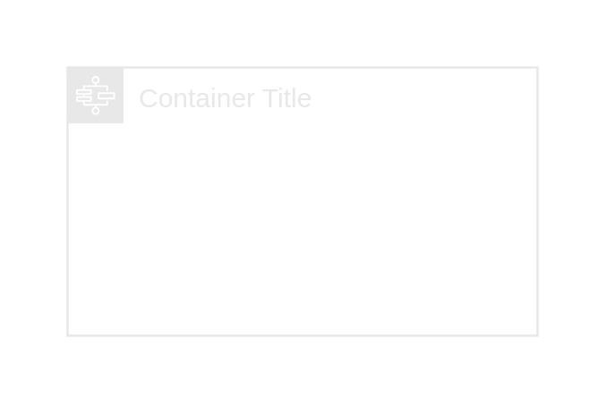

# AWS Step Functions workflow

## Definition

```
{
  _style: {
    group: 'sketch=0;outlineConnect=0;gradientColor=none;html=1;whiteSpace=wrap;fontSize=12;fontStyle=0;shape=mxgraph.aws4.group;grIcon=mxgraph.aws4.group_aws_step_functions_workflow;strokeColor=#E8E8E8;fillColor=none;verticalAlign=top;align=left;spacingLeft=30;fontColor=#E8E8E8;dashed=0;',
    entity:{
      strokeColor:'#E8E8E8',fontColor:'#E8E8E8',},
    
  },
}
```

## Usage

```
import { AwsStepFunctionsWorkflow } from '@reactiac/standard-components-diagrams/aws18GroupsDark'

<AwsStepFunctionsWorkflow/>
```

## Preview


