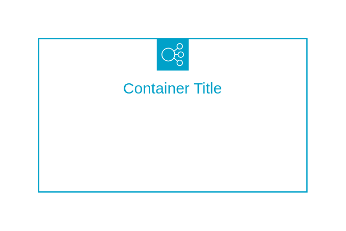

# Elastic Load Balancing

## Definition

```
{
  _style: {
    group: 'sketch=0;outlineConnect=0;gradientColor=none;html=1;whiteSpace=wrap;fontSize=12;fontStyle=0;shape=mxgraph.aws4.groupCenter;grIcon=mxgraph.aws4.group_elastic_load_balancing;grStroke=1;strokeColor=#00A1C9;fillColor=none;verticalAlign=top;align=center;fontColor=#00A1C9;dashed=0;spacingTop=25;',
    entity:{
      strokeColor:'#00A1C9',fontColor:'#00A1C9',},
    
  },
}
```

## Usage

```
import { ElasticLoadBalancing } from '@dinghy/standard-components-diagrams/aws18GroupsDark'

<ElasticLoadBalancing/>
```

## Preview


