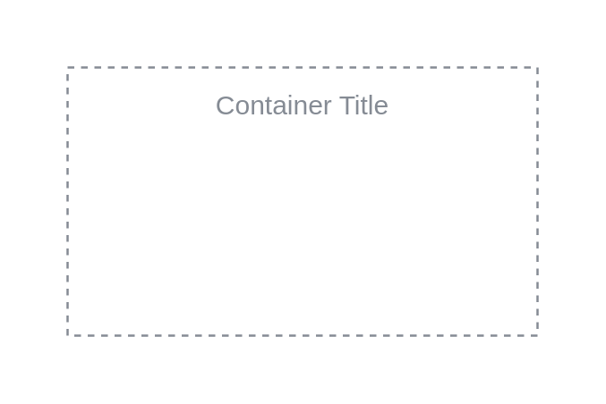

# Generic Group

## Definition

```
{
  _style: {
    group: 'outlineConnect=0;gradientColor=none;html=1;whiteSpace=wrap;fontSize=12;fontStyle=0;strokeColor=#858B94;fillColor=none;verticalAlign=top;align=center;fontColor=#858B94;dashed=1;spacingTop=3;',
    entity:{
      strokeColor:'#858B94',fontColor:'#858B94',},
    
  },
}
```

## Usage

```
import { GenericGroup } from '@dinghy/standard-components-diagrams/aws18GroupsDark'

<GenericGroup/>
```

## Preview


