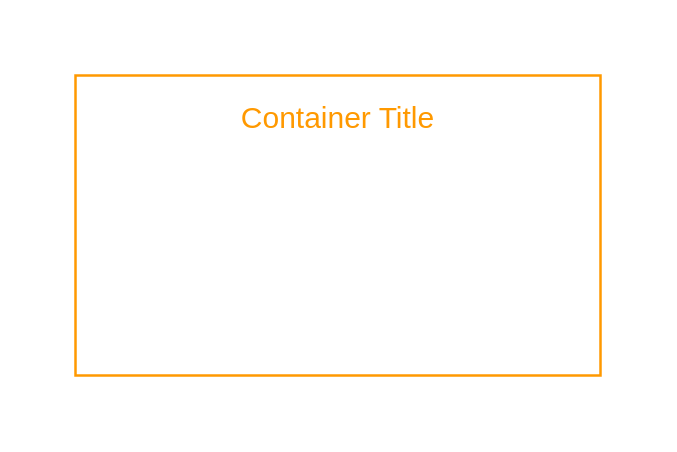

# Highlight

## Definition

```
{
  _style: {
    group: 'outlineConnect=0;gradientColor=none;html=1;whiteSpace=wrap;fontSize=12;fontStyle=0;strokeColor=#FF9900;fillColor=none;verticalAlign=top;align=center;fontColor=#FF9900;dashed=0;spacingTop=3;',
    entity:{
      strokeColor:'#FF9900',fontColor:'#FF9900',},
    
  },
}
```

## Usage

```
import { Highlight } from '@diac/standard-components-diagrams/aws18GroupsDark'

<Highlight/>
```

## Preview


