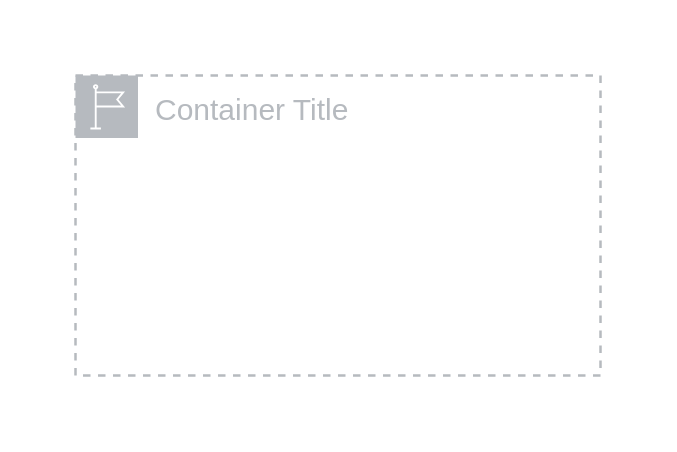

# Region

## Definition

```
{
  _style: {
    group: 'sketch=0;outlineConnect=0;gradientColor=none;html=1;whiteSpace=wrap;fontSize=12;fontStyle=0;shape=mxgraph.aws4.group;grIcon=mxgraph.aws4.group_region;strokeColor=#B6BABF;fillColor=none;verticalAlign=top;align=left;spacingLeft=30;fontColor=#B6BABF;dashed=1;',
    entity:{
      strokeColor:'#B6BABF',fontColor:'#B6BABF',},
    
  },
}
```

## Usage

```
import { Region } from '@reactiac/standard-components-diagrams/aws18GroupsDark'

<Region/>
```

## Preview


