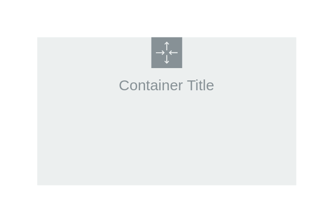

# Auto Scaling Group

## Definition

```
{
  _style: {
    group: 'sketch=0;outlineConnect=0;gradientColor=none;html=1;whiteSpace=wrap;fontSize=12;fontStyle=0;shape=mxgraph.aws4.groupCenter;grIcon=mxgraph.aws4.group_auto_scaling_group;grStroke=0;strokeColor=#879196;fillColor=#ECEFEF;verticalAlign=top;align=center;fontColor=#879196;dashed=0;spacingTop=25;',
    entity:{
      strokeColor:'#879196',fillColor:'#ECEFEF',fontColor:'#879196',},
    
  },
}
```

## Usage

```
import { AutoScalingGroup } from '@diac/standard-components-diagrams/aws18GroupsLight'

<AutoScalingGroup/>
```

## Preview


