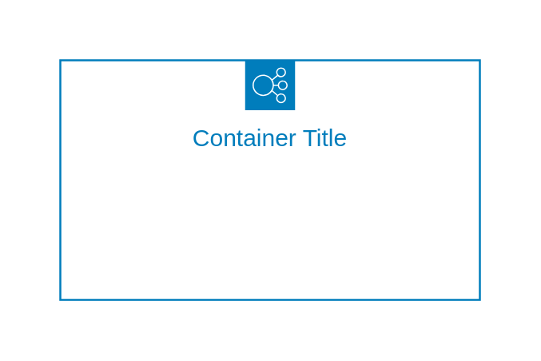
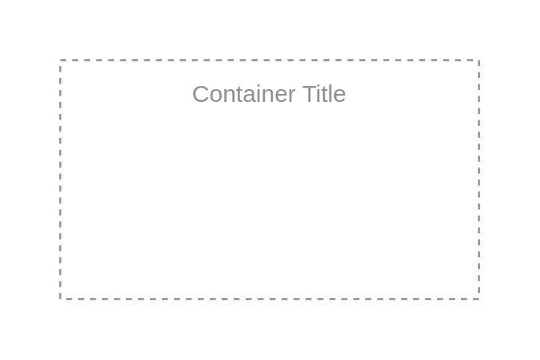
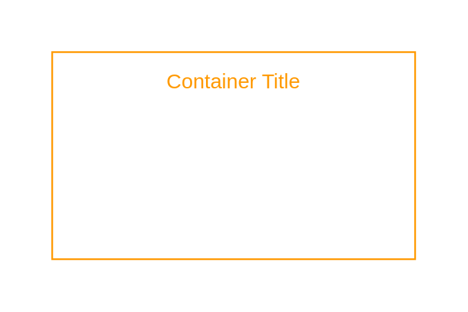
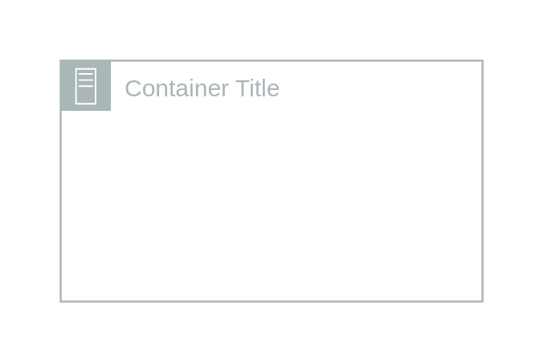
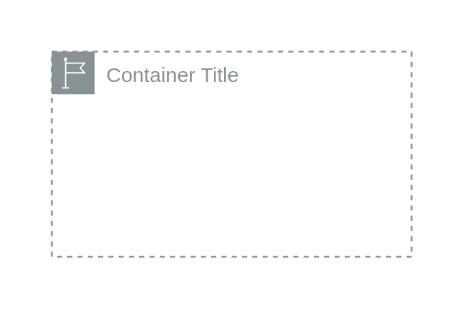
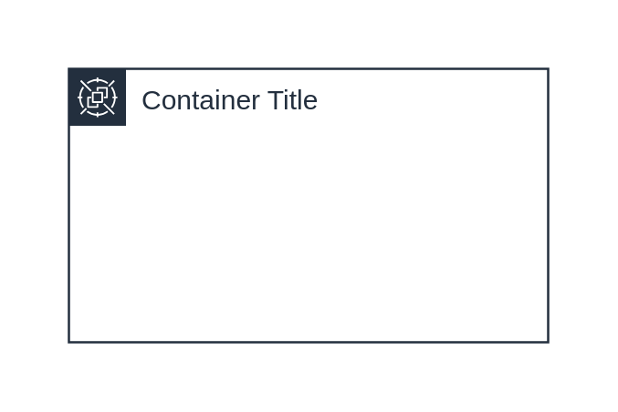

# Aws18 Groups (light) Containers

- [AutoScalingGroup](./auto-scaling-group.md)  

- [AvailabilityZone](./availability-zone.md)  

- [AwsCloud](./aws-cloud.md)  

- [AwsStepFunctionsWorkflow](./aws-step-functions-workflow.md)  

- [ElasticLoadBalancing](./elastic-load-balancing.md)  

- [GenericGroup](./generic-group.md)  

- [Highlight](./highlight.md)  

- [OnPremise](./on-premise.md)  

- [Region](./region.md)  

- [SpotFleet](./spot-fleet.md)  

- [Subnet](./subnet.md)  

- [Vpc](./vpc.md)  

