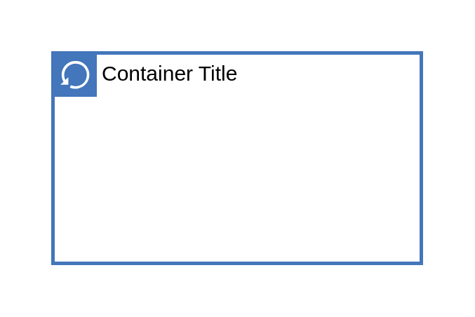

# Classic Infrastructure

## Definition

```
{
  _style: {
    group: 'shape=mxgraph.ibm.box;prType=classic;fontStyle=0;verticalAlign=top;align=left;spacingLeft=32;spacingTop=4;fillColor=none;rounded=0;whiteSpace=wrap;html=1;strokeColor=#4376BB;strokeWidth=2;dashed=0;container=1;spacing=-4;collapsible=0;expand=0;recursiveResize=0;',
    entity:{
      strokeColor:'#4376BB',},
    
  },
}
```

## Usage

```
import { ClassicInfrastructure } from '@diac/standard-components-diagrams/ibmBoxes'

<ClassicInfrastructure/>
```

## Preview


