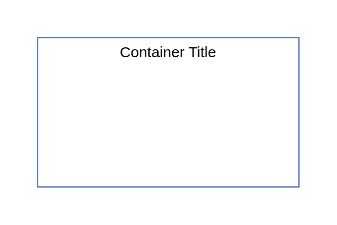
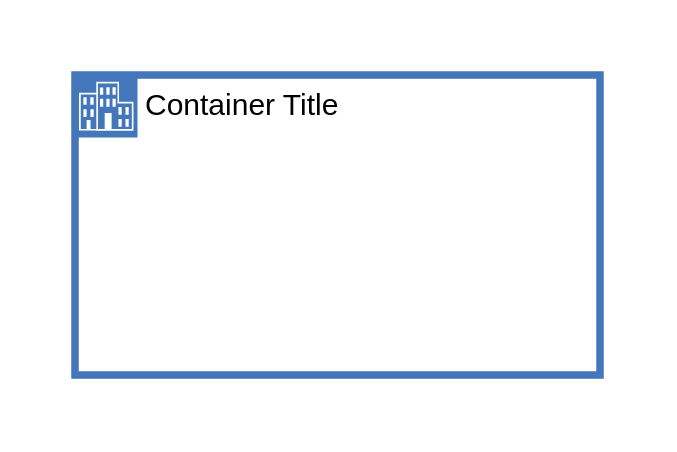
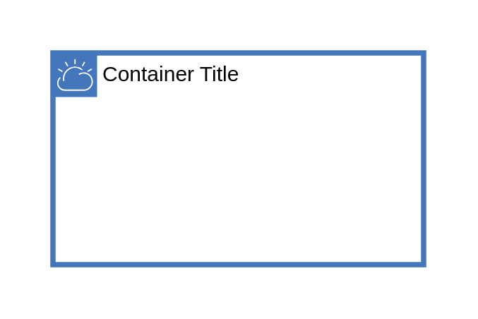
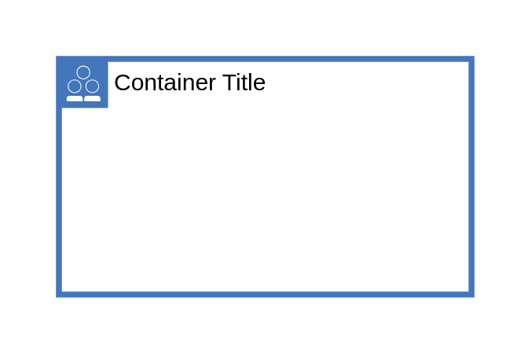
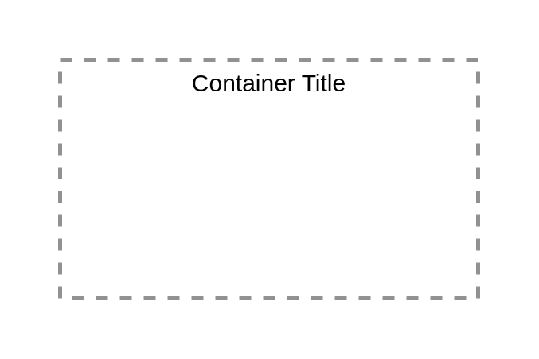
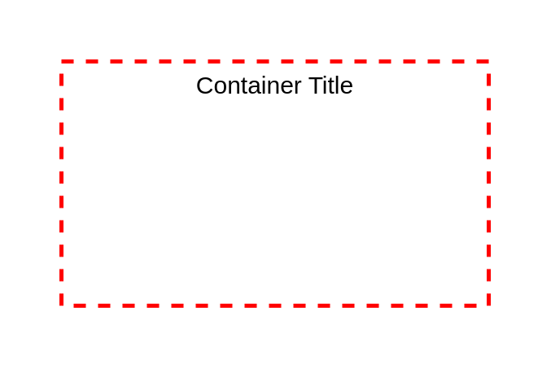
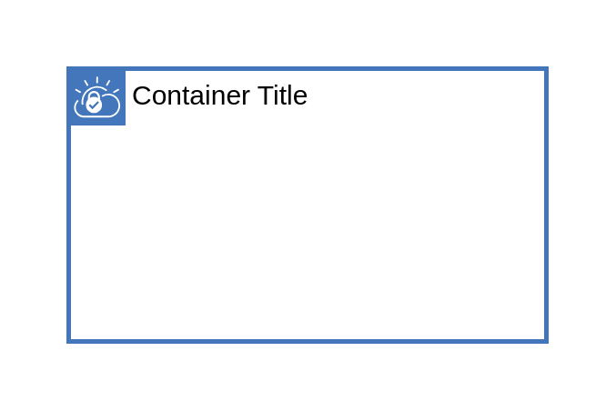

# Ibm Boxes Containers

- [ClassicInfrastructure](./classic-infrastructure.md)  

- [CloudServices](./cloud-services.md)  

- [EnterpriseNetwork](./enterprise-network.md)  

- [IbmCloud](./ibm-cloud.md)  

- [InstanceGroup](./instance-group.md)  

- [PublicNetwork](./public-network.md)  

- [Region](./region.md)  

- [ResourceGroup](./resource-group.md)  

- [SecurityGroup](./security-group.md)  

- [SubnetAcl](./subnet-acl.md)  

- [Vpc](./vpc.md)  

- [Zone](./zone.md)  

