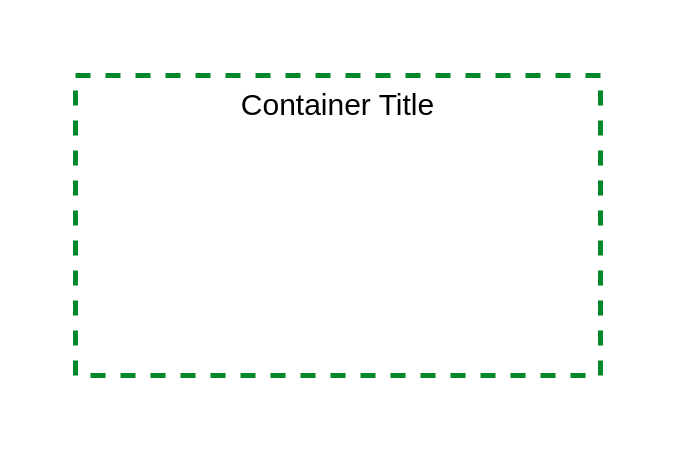

# Instance Group

## Definition

```
{
  _style: {
    group: 'fontStyle=0;verticalAlign=top;align=center;spacingTop=-2;fillColor=none;rounded=0;whiteSpace=wrap;html=1;strokeColor=#00882B;strokeWidth=2;dashed=1;container=1;collapsible=0;expand=0;recursiveResize=0;',
    entity:{
      strokeColor:'#00882B',},
    
  },
}
```

## Usage

```
import { InstanceGroup } from '@diac/standard-components-diagrams/ibmBoxes'

<InstanceGroup/>
```

## Preview


