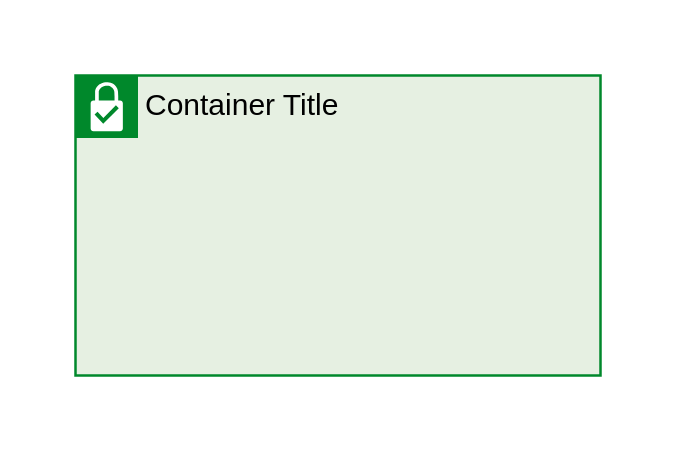

# Subnet:ACL

## Definition

```
{
  _style: {
    group: 'shape=mxgraph.ibm.box;prType=subnet;fontStyle=0;verticalAlign=top;align=left;spacingLeft=32;spacingTop=4;fillColor=#E6F0E2;rounded=0;whiteSpace=wrap;html=1;strokeColor=#00882B;strokeWidth=1;dashed=0;container=1;spacing=-4;collapsible=0;expand=0;recursiveResize=0;',
    entity:{
      strokeColor:'#00882B',fillColor:'#E6F0E2',},
    
  },
}
```

## Usage

```
import { SubnetAcl } from '@dinghy/standard-components-diagrams/ibmBoxes'

<SubnetAcl/>
```

## Preview


