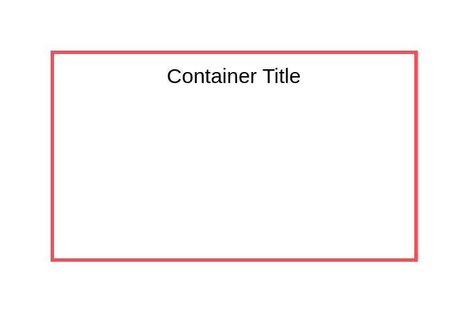

# Authorization Boundary

## Definition

```
{
  _style: {
    group: 'container=1;collapsible=0;expand=0;recursiveResize=0;html=1;whiteSpace=wrap;strokeColor=#FA4D56;fillColor=none;strokeWidth=2',
    entity:{
      strokeColor:'#FA4D56',},
    
  },
}
```

## Usage

```
import { AuthorizationBoundary } from '@reactiac/standard-components-diagrams/ibmCloudGroups'

<AuthorizationBoundary/>
```

## Preview


