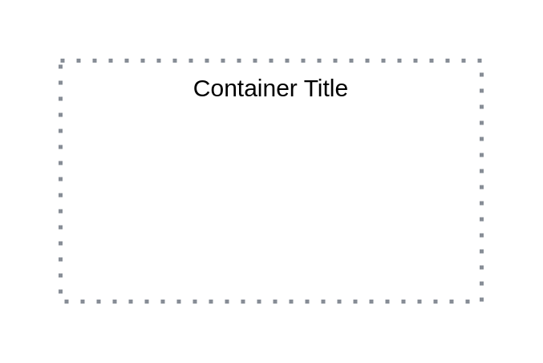

# Availability Zone

## Definition

```
{
  _style: {
    group: 'container=1;collapsible=0;expand=0;recursiveResize=0;html=1;whiteSpace=wrap;strokeColor=#878D96;fillColor=none;dashed=1;dashPattern=1 3;strokeWidth=2',
    entity:{
      strokeColor:'#878D96',},
    
  },
}
```

## Usage

```
import { AvailabilityZone } from '@diac/standard-components-diagrams/ibmCloudGroups'

<AvailabilityZone/>
```

## Preview


