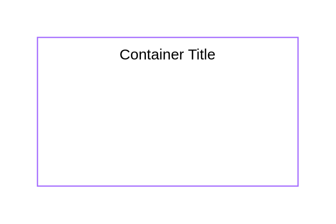

# Expanded Application

## Definition

```
{
  _style: {
    group: 'container=1;collapsible=0;expand=0;recursiveResize=0;html=1;whiteSpace=wrap;strokeColor=#A56EFF;fillColor=none;',
    entity:{
      strokeColor:'#A56EFF',},
    
  },
}
```

## Usage

```
import { ExpandedApplication } from '@dinghy/standard-components-diagrams/ibmCloudGroups'

<ExpandedApplication/>
```

## Preview


