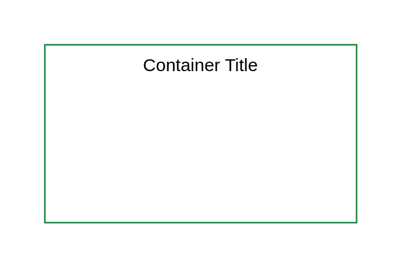

# Expanded Virtual Server

## Definition

```
{
  _style: {
    group: 'container=1;collapsible=0;expand=0;recursiveResize=0;html=1;whiteSpace=wrap;strokeColor=#198038;fillColor=none;',
    entity:{
      strokeColor:'#198038',},
    
  },
}
```

## Usage

```
import { ExpandedVirtualServer } from '@dinghy/standard-components-diagrams/ibmCloudGroups'

<ExpandedVirtualServer/>
```

## Preview


