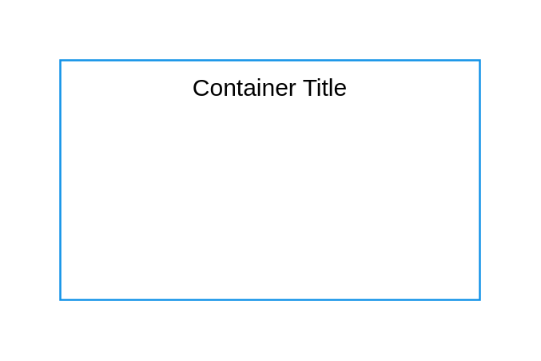

# IBM Cloud

## Definition

```
{
  _style: {
    group: 'container=1;collapsible=0;expand=0;recursiveResize=0;html=1;whiteSpace=wrap;strokeColor=#1192E8;fillColor=none;strokeWidth=1',
    entity:{
      strokeColor:'#1192E8',},
    
  },
}
```

## Usage

```
import { IbmCloud } from '@diac/standard-components-diagrams/ibmCloudGroups'

<IbmCloud/>
```

## Preview


