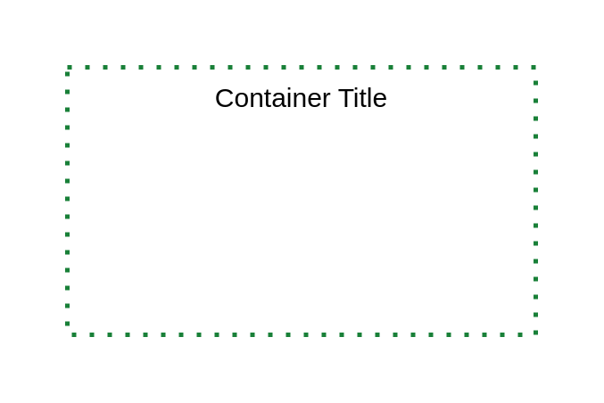
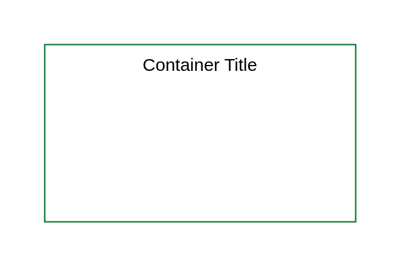
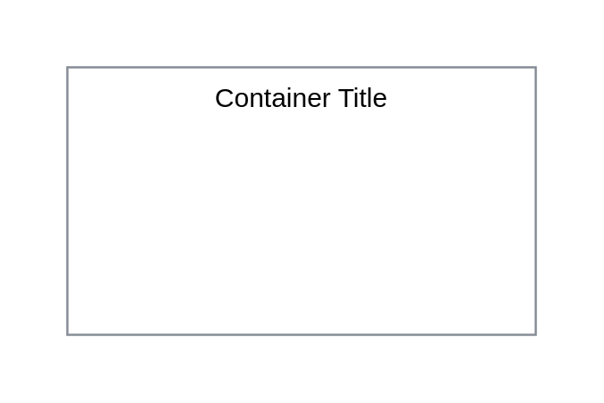
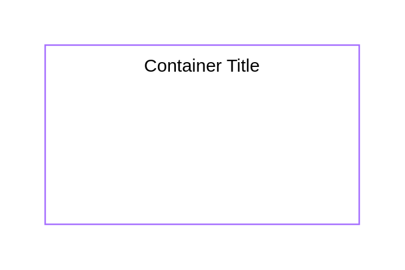

# Ibm Groups Containers

- [AccessGroup](./access-group.md)  

- [AuthorizationBoundary](./authorization-boundary.md)  

- [AvailabilityZone](./availability-zone.md)  

- [ExpandedApplication](./expanded-application.md)  

- [ExpandedVirtualServer](./expanded-virtual-server.md)  

- [IbmCloud](./ibm-cloud.md)  

- [InstanceGroup](./instance-group.md)  

- [Openshift](./openshift.md)  

- [PointOfPresence](./point-of-presence.md)  

- [Watsonx](./watsonx.md)  

