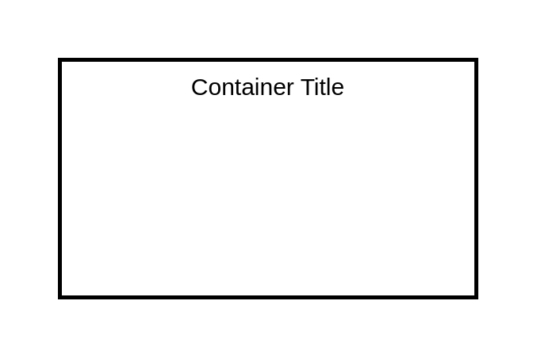

# Table

## Definition

```
{
  _style: {
    group: 'shape=table;html=1;whiteSpace=wrap;startSize=0;container=1;collapsible=0;childLayout=tableLayout;strokeWidth=2;',
    
  },
}
```

## Usage

```
import { Table } from '@diac/standard-components-diagrams/mockupText'

<Table/>
```

## Preview


