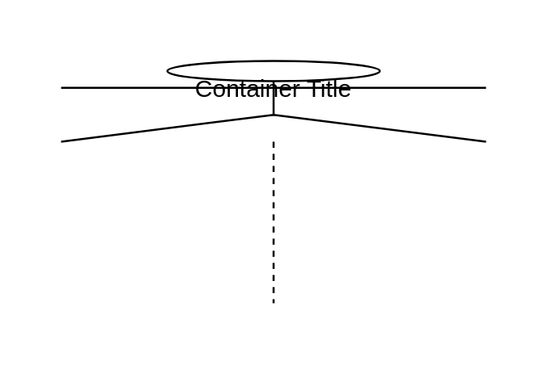
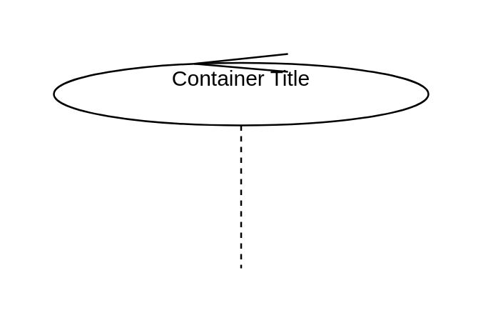
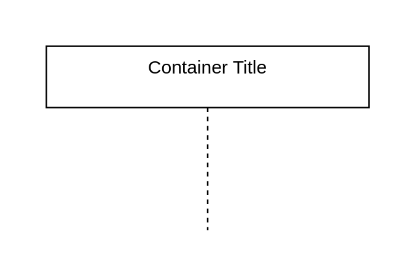

# Uml UML Containers

- [ActorLifeline](./actor-lifeline.md)  

- [BoundaryLifeline](./boundary-lifeline.md)  

- [ControlLifeline](./control-lifeline.md)  

- [EntityLifeline](./entity-lifeline.md)  

- [Lifeline](./lifeline.md)  

