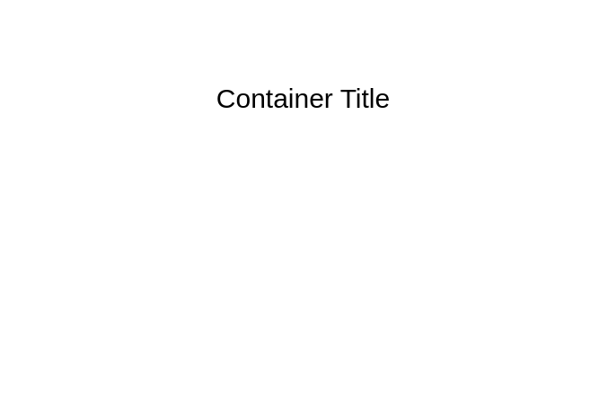

# Activity Partition 2

## Definition

```
{
  _style: {
    group: 'shape=table;html=1;whiteSpace=wrap;startSize=20;container=1;collapsible=0;childLayout=tableLayout;fillColor=none;swimlaneFillColor=#ffffff;strokeColor=none;',
    entity:{
      },
    
  },
}
```

## Usage

```
import { ActivityPartition2 } from '@reactiac/standard-components-diagrams/uml25'

<ActivityPartition2/>
```

## Preview


