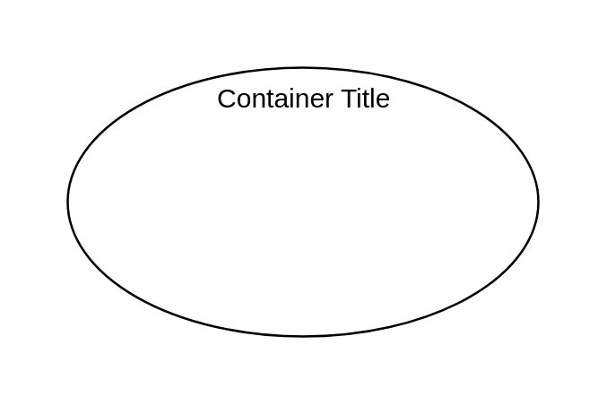

# Classifier 7

## Definition

```
{
  _style: {
    group: 'shape=ellipse;container=1;horizontal=1;horizontalStack=0;resizeParent=1;resizeParentMax=0;resizeLast=0;html=1;dashed=0;collapsible=0;',
    
  },
}
```

## Usage

```
import { Classifier7 } from '@dinghy/standard-components-diagrams/uml25'

<Classifier7/>
```

## Preview


