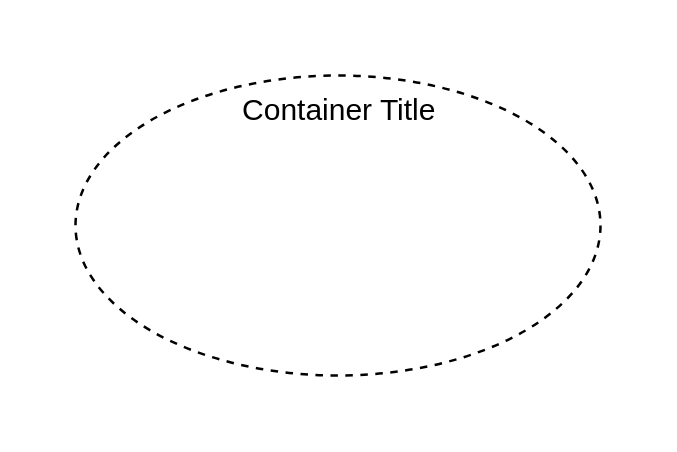
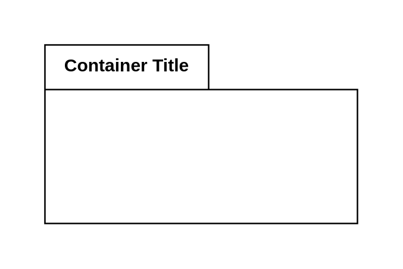
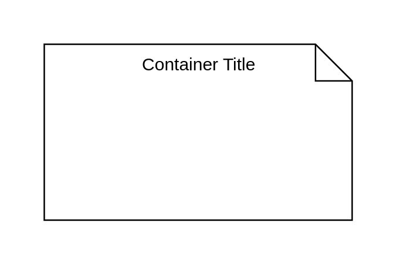

# Uml UML 2.5 Containers

- [ActivityPartition2](./activity-partition-2.md)  

- [Classifier6](./classifier-6.md)  

- [Classifier7](./classifier-7.md)  

- [Diagram](./diagram.md)  

- [Interaction](./interaction.md)  

- [Interaction2](./interaction-2.md)  

- [LifelineContinuation2](./lifeline-continuation-2.md)  

- [Lifelines](./lifelines.md)  

- [Package2](./package-2.md)  

- [Package3](./package-3.md)  

- [Stereotype](./stereotype.md)  

