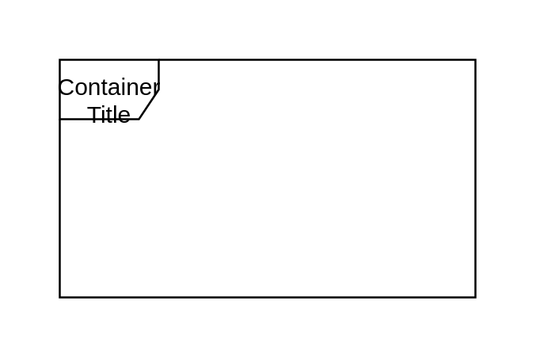

# Interaction 2

## Definition

```
{
  _style: {
    group: 'shape=umlFrame;whiteSpace=wrap;html=1;pointerEvents=0;recursiveResize=0;container=1;collapsible=0;width=50;',
    
  },
}
```

## Usage

```
import { Interaction2 } from '@dinghy/standard-components-diagrams/uml25'

<Interaction2/>
```

## Preview


