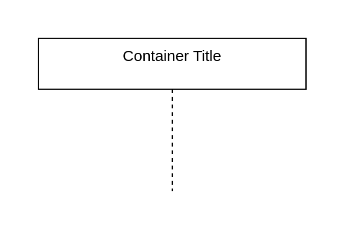

# Lifelines

## Definition

```
{
  _style: {
    group: 'shape=umlLifeline;perimeter=lifelinePerimeter;whiteSpace=wrap;html=1;container=1;dropTarget=0;collapsible=0;recursiveResize=0;outlineConnect=0;portConstraint=eastwest;newEdgeStyle={&#34;edgeStyle&#34;:&#34;elbowEdgeStyle&#34;,&#34;elbow&#34;:&#34;vertical&#34;,&#34;curved&#34;:0,&#34;rounded&#34;:0};',
    
  },
}
```

## Usage

```
import { Lifelines } from '@diac/standard-components-diagrams/uml25'

<Lifelines/>
```

## Preview


