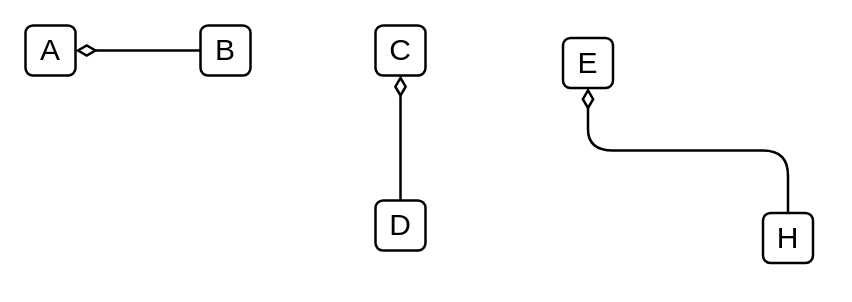

# Aggregation

## Definition

```
{
  _style: { 
    dependency: 'endArrow=none;html=1;endFill=0;startArrow=diamondThin;startFill=0;edgeStyle=elbowEdgeStyle;elbow=vertical',
  },
}
```

## Usage

```
import { Aggregation } from '@reactiac/standard-components-diagrams/archimate2'

<Aggregation/>
```

## Preview


