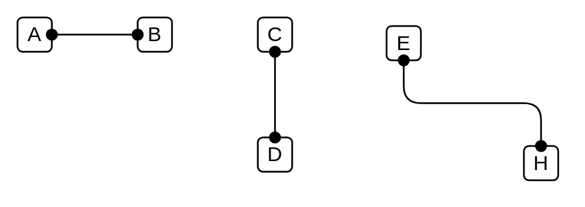

# Assignment

## Definition

```
{
  _style: { 
    dependency: 'endArrow=oval;html=1;endFill=1;startArrow=oval;startFill=1;edgeStyle=elbowEdgeStyle;elbow=vertical',
  },
}
```

## Usage

```
import { Assignment } from '@dinghy/standard-components-diagrams/archimate2'

<Assignment/>
```

## Preview


