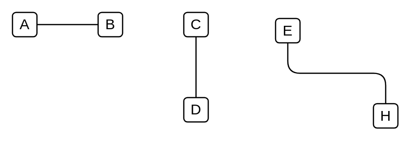

# Association

## Definition

```
{
  _style: { 
    dependency: 'edgeStyle=elbowEdgeStyle;html=1;endArrow=none;elbow=vertical',
  },
}
```

## Usage

```
import { Association } from '@diac/standard-components-diagrams/archimate2'

<Association/>
```

## Preview


