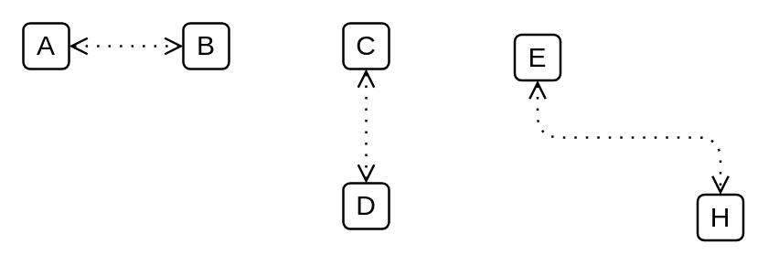

# Access 2

## Definition

```
{
  _style: { 
    dependency: 'edgeStyle=elbowEdgeStyle;html=1;endArrow=open;elbow=vertical;endFill=0;dashed=1;startArrow=open;startFill=0;dashPattern=1 4;',
  },
}
```

## Usage

```
import { Access2 } from '@reactiac/standard-components-diagrams/archimate3Relationships'

<Access2/>
```

## Preview


