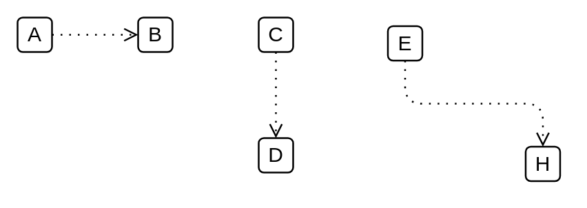

# Access 3

## Definition

```
{
  _style: { 
    dependency: 'edgeStyle=elbowEdgeStyle;html=1;endArrow=open;elbow=vertical;endFill=0;dashed=1;dashPattern=1 4;',
  },
}
```

## Usage

```
import { Access3 } from '@dinghy/standard-components-diagrams/archimate3Relationships'

<Access3/>
```

## Preview


