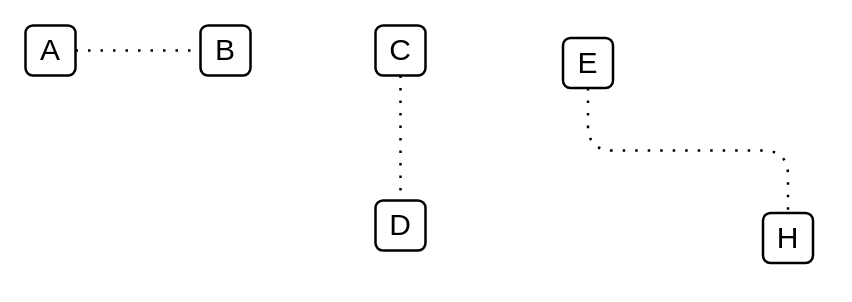

# Access

## Definition

```
{
  _style: { 
    dependency: 'edgeStyle=elbowEdgeStyle;html=1;endArrow=none;elbow=vertical;dashed=1;startFill=0;dashPattern=1 4;',
  },
}
```

## Usage

```
import { Access } from '@dinghy/standard-components-diagrams/archimate3Relationships'

<Access/>
```

## Preview


