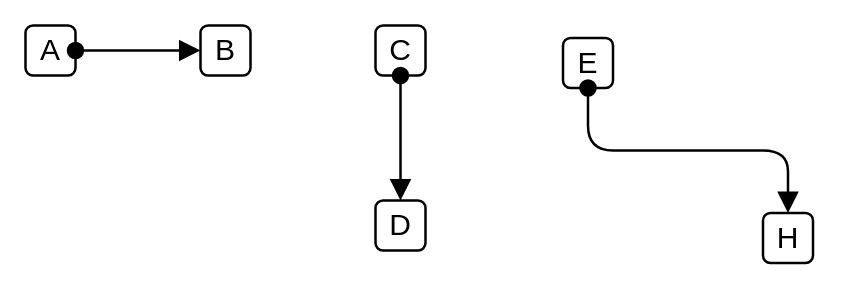

# Assignment

## Definition

```
{
  _style: { 
    dependency: 'endArrow=block;html=1;endFill=1;startArrow=oval;startFill=1;edgeStyle=elbowEdgeStyle;elbow=vertical;',
  },
}
```

## Usage

```
import { Assignment } from '@reactiac/standard-components-diagrams/archimate3Relationships'

<Assignment/>
```

## Preview


