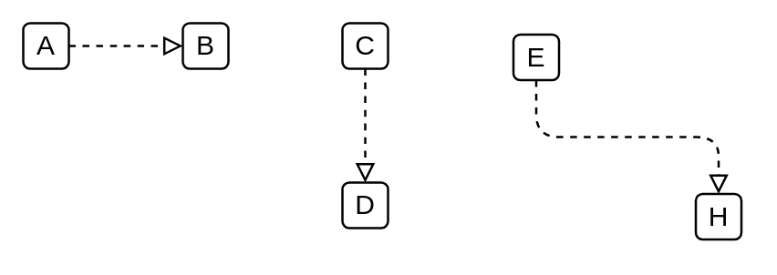

# Realization

## Definition

```
{
  _style: { 
    dependency: 'edgeStyle=elbowEdgeStyle;html=1;endArrow=block;elbow=vertical;endFill=0;dashed=1;',
  },
}
```

## Usage

```
import { Realization } from '@diac/standard-components-diagrams/archimate3Relationships'

<Realization/>
```

## Preview


