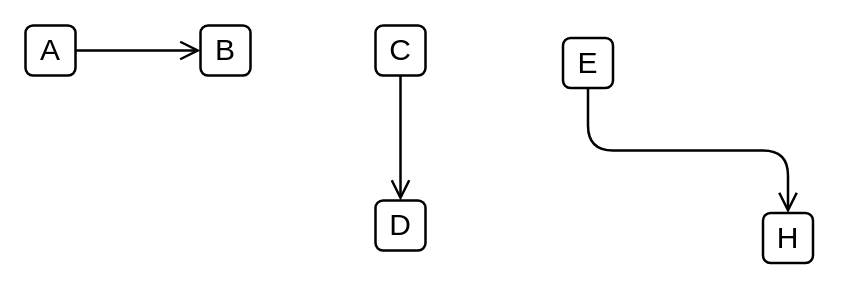

# Serving

## Definition

```
{
  _style: { 
    dependency: 'edgeStyle=elbowEdgeStyle;html=1;endArrow=open;elbow=vertical;endFill=1;',
  },
}
```

## Usage

```
import { Serving } from '@reactiac/standard-components-diagrams/archimate3Relationships'

<Serving/>
```

## Preview


